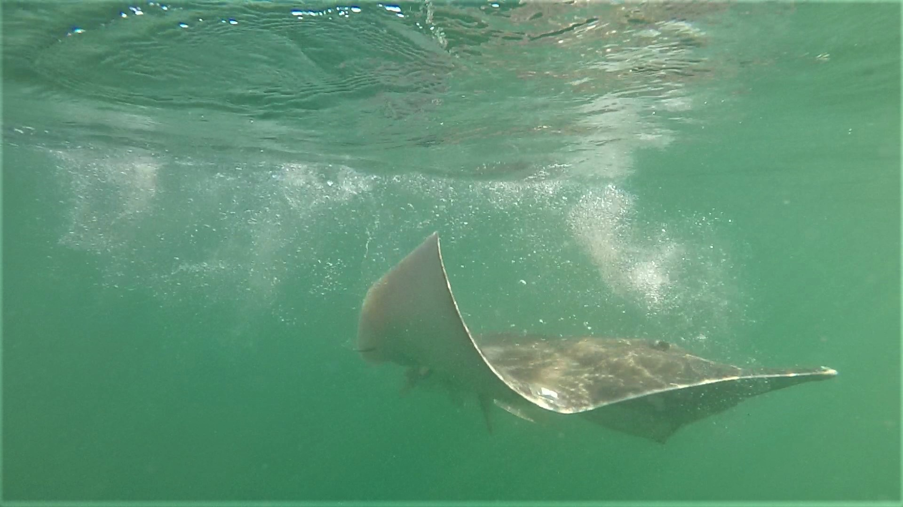

^1^ Royal Zoological Society of Scotland, RZSS Edinburgh Zoo, Scotland  
^2^  Centre for Research into Ecological and Environmental Modelling, University of St Andrews, Scotland  
^3^  Scottish Oceans Institute, University of St Andrews, Scotland  
^4^  NatureScot, Oban, Scotland

^\*^ This repository is maintained by Edward Lavender (<el72@st-andrews.ac.uk>).

## Introduction

This repository contains methods, written in `R` and organised as an `R Project`, for Cole et al. (in prep). Physiological responses to capture and handling in flapper skate (*Dipturus intermedius*).

We studied the physiological responses of flapper skate following catch-and-release angling and acoustic tagging in the Loch Sunart to the Sound of Jura Marine Protected Area on the west coast of Scotland (Figure 1). We recorded capture fight times and blood parameters following capture (blood sample one: BS1) and following handling (blood sample two: BS2). Using statistical modelling (as recorded in this repository) we investigated capture fights and relationships between blood parameters (for both BS1 and BS2) and aspects of the capture and handing process (such as fight time), individual characteristics (such as sex) and environmental conditions (such as temperature). This work was conducted as part of the Movement Ecology of Flapper Skate project. 

_Figure 1. A flapper skate is released following capture and handing in the Loch Sunart to the Sound of Jura Marine Protected Area on the west coast of Scotland. Photograph courtesy of the Movement Ecology of Flapper Skate project._

## Structure

1.  **`data-raw/`** contains 'raw' data for the project:
      - `skate/` contains skate data: 
          - `Skate acoustic tagging data .xlsx` contains raw data from capture and tagging, including the details of capture events, blood parameters and heart and respiratory rates during handling, with one individual per sheet. This file is used for the fight time, heart and respiratory rate analyses in this project. 
          - `Skate data analysis shared.xlsx` summarises capture events and blood parameters in one place. (This document was collated by G. C. Cole.) The `Data all without formulas` sheet includes capture events, raw blood parameters and temperature-corrected blood parameter values. This sheet is used for the blood parameter analyses in this project. 
      - `spatial/` contains spatial data:
          - `coast/` contains coastline data for the region, sourced from the [Database of Global Administrative Areas](https://biogeo.ucdavis.edu/data/gadm3.6/Rsp/gadm36_GBR_0_sp.rds); 
          - `mesh/` contains mesh files for the West Scotland Coastal Ocean Modelling System (WeStCOMS), sourced from [Dmitry Aleynik](https://www.sams.ac.uk/people/researchers/aleynik-dr-dmitry/) at the Scottish Association for Marine Science (SAMS). These files are also available from the [SAMS Thredds Server](https://www.sams.ac.uk/facilities/thredds/);   
      
2.  **`data/`** contains processed data:
      - `skate/` contains processed skate data:
          - `physio.rds` contains processed blood physiology data from `process_bloods.R` (see below). 
          - `vital.rds` contains processed vital signs data from `process_vitals.R` (see below). 
          - `fights.rds` contains processed capture fights data from `process_fights.R` (see below). 
      - `spatial/` contains processed spatial data:
          - `bathy/` contains one arc-second bathymetry data from [Digimap](https://digimap.edina.ac.uk) (higher resolution data from the [Ireland, Northern Ireland and Scotland Hydrographic surveys](https://doi.org/10.1017/S1755691015000146) are not available for all sampled locations);
          - `coast/` contains processed coastline data from `process_spatial.R` (see below);
          - `mesh/` contains processed WeStCOMS mesh files from `process_spatial.R` (see below); 
      - `estimates/` contains model outputs from `analyse_*.R` scripts;   

3.  **`R/`** contains scripts for data processing and analysis:
      - `define_global_param.R` defines global parameters;
      - `process_bloods.R` processes raw blood parameter data;
      - `process_vitals.R` processes raw vital signs data;
      - `process_spatial.R` processes raw spatial data;
      - `process_fights.R` processes raw capture fights data;
      - `analyse_fights.R` analyses capture fights;
      - `analyse_bloods.R` analyses BS1 and BS2;
      - `analyse_bloods_change.R` analyses the change in blood parameters during handling;
      - `analyse_bloods_synthesis.R` synthesises results across blood parameters;
      - `analyse_vitals.R` analyses heart and respiratory rates during handling;   
      
4.  **`fig/`** contains tables and figures.

Note that the `data-raw`, `data` and `fig` directories are not provided in the online version of this repository.

## Workflow

1. **Define global parameters** via `define_global_param.R`.

2. **Process raw data** via `process_bloods.R`, `process_vitals.R`, `process_spatial.R` and `process_fights.R`. 

3. **Implement data analysis** via `analyse_fights.R`, `analyse_bloods.R`, `analyse_bloods_change.R`, `analyse_bloods_synthesis.R` and `analyse_vitals.R`. 

# GitHub packages

This repository uses a number of non-default packages, available from [The Comprehensive R Archive Network](https://cran.r-project.org). These can be installed with `install.packages()`. Three packages that are only available on [GitHub](https://github.com/) are also used:

  - [`fvcom.tbx`](https://github.com/edwardlavender/fvcom.tbx). This package is used to interact with WeStCOMS. 
  - [`prettyGraphics`](https://github.com/edwardlavender/prettyGraphics). This package is used for plotting, e.g., via `pretty_predictions_1d()`.
  - [`utils.add`](https://github.com/edwardlavender/utils.add). This package is used for summarising data or function outputs.  

## Citation

Cole, et al. (in prep). Physiological responses to capture and handling in flapper skate (*Dipturus intermedius*).