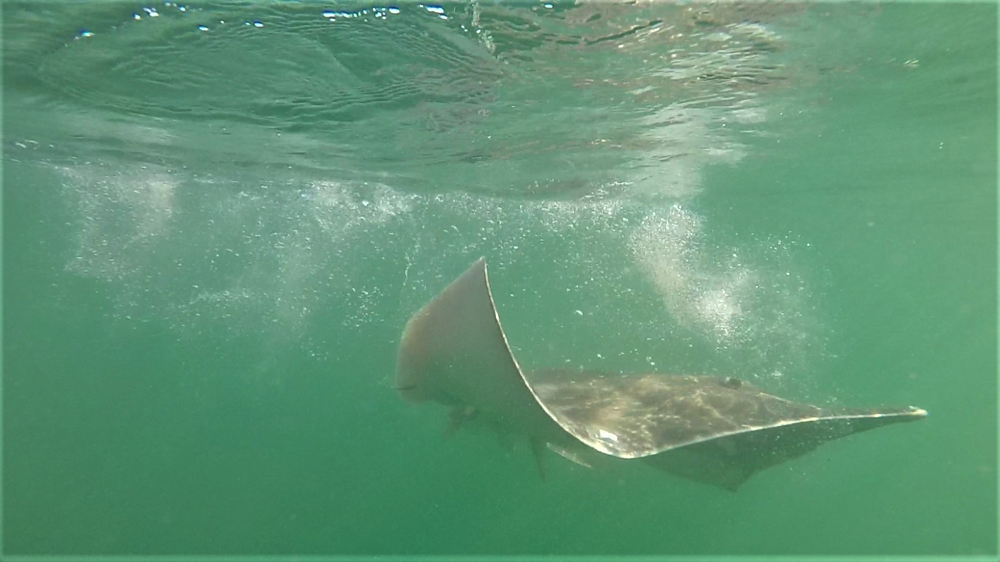

Physiological responses to capture and handling in flapper skate
(*Dipturus intermedius*)
================
Georgina C. Cole1, Adam Naylor1, Simon J.
Girling1, Edward Lavender2,3\*, Jane
Dodd4, James A. Thorburn3

1 Royal Zoological Society of Scotland  
2 Centre for Research into Ecological and Environmental
Modelling, University of St Andrews, Scotland  
3 Scottish Oceans Institute, University of St Andrews,
Scotland  
4 NatureScot, Oban, Scotland

\* This repository is maintained by Edward Lavender
(<el72@st-andrews.ac.uk>).

## Introduction

This repository contains methods, written in `R` and organised as an `R
Project`, for Cole et al. (in prep). Physiological responses to capture
and handling in flapper skate (*Dipturus intermedius*).

We studied the physiological responses of flapper skate following
catch-and-release angling and acoustic tagging in the Loch Sunart to the
Sound of Jura Marine Protected Area on the west coast of Scotland
(Figure 1). We recorded blood parameters following capture (blood sample
one: BS1) and following handling (blood sample two: BS2). Using
statistical modelling (as recorded in this repository) we investigated
relationships between blood parameters for both BS1 and BS2 and aspects
of the capture and handing process (such as fight time), individual
characteristics (such as sex) and environmental conditions (such as
temperature). This work was conducted as part of the Movement Ecology of
Flapper Skate project.

*Figure 1. A flapper skate is released following capture and handing in
the Loch Sunart to the Sound of Jura Marine Protected Area on the west
coast of Scotland. Photograph courtesy of the Movement Ecology of
Flapper Skate project.*

## Structure

1.  **`data-raw/`** contains ‘raw’ data for the project:
      - `Skate data analysis shared.xlsx` contains raw data collated by
        G. C. Cole, including the details of capture events and blood
        parameters. This project is based on the `Data all without
        formulas` sheet, which details capture events, raw blood
        parameters and temperature-corrected blood parameter values. The
        latter are used for analyses in this project.   
2.  **`data/`** contains processed data:
      - `physio.rds` contains processed data from `process_data_raw.R`
        (see below).   
3.  **`R/`** contains scripts for data processing and analysis:
      - `define_global_param.R` defines global parameters.
      - `process_data_raw.R` processes raw data.
      - `analyse_bloods.R` analyses BS1 and BS2.
      - `analyse_bloods_change.R` analyses the change in blood
        parameters during handling.   
4.  **`fig/`** contains tables and figures.

Note that the `data-raw`, `data` and `fig` directories are not provided
in the online version of this repository.

## Workflow

1.  **Define global parameters** via `define_global_param.R`.

2.  **Process raw data** via `process_data_raw.R`.

3.  **Implement data analysis** via `analyse_bloods.R` and
    `analyse_bloods_change.R`.

# GitHub packages

This repository uses a number of non-default packages, available from
[The Comprehensive R Archive Network](https://cran.r-project.org). These
can be installed with `install.packages()`. Two packages that are only
available on [GitHub](https://github.com/) are also used:

  - [`prettyGraphics`](https://github.com/edwardlavender/prettyGraphics).
    This package is used for plotting, e.g., via
    `pretty_predictions_1d()`.
  - [`utils.add`](https://github.com/edwardlavender/utils.add). This
    package is used occasionally for summarising data or function
    outputs.

## Citation

Cole, et al. (in prep). Physiological responses to capture and handling
in flapper skate (*Dipturus intermedius*).
